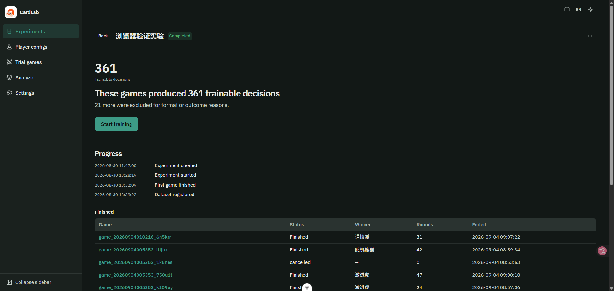
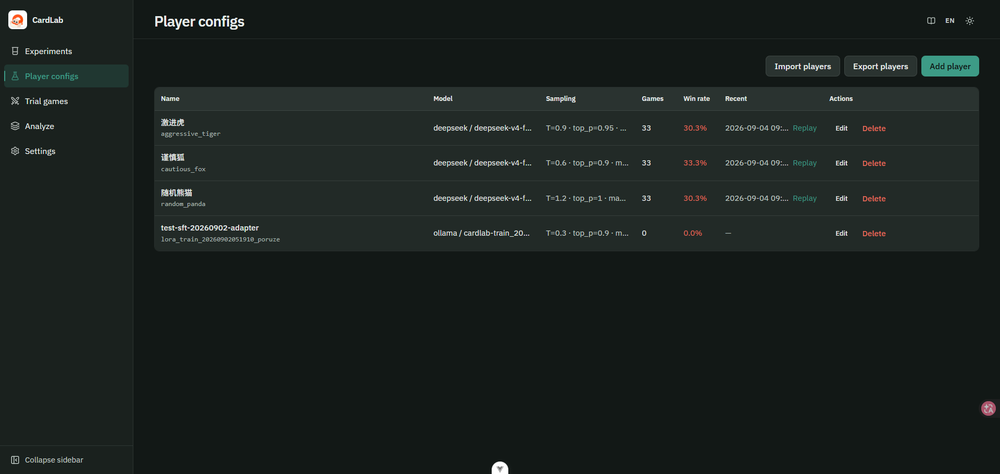
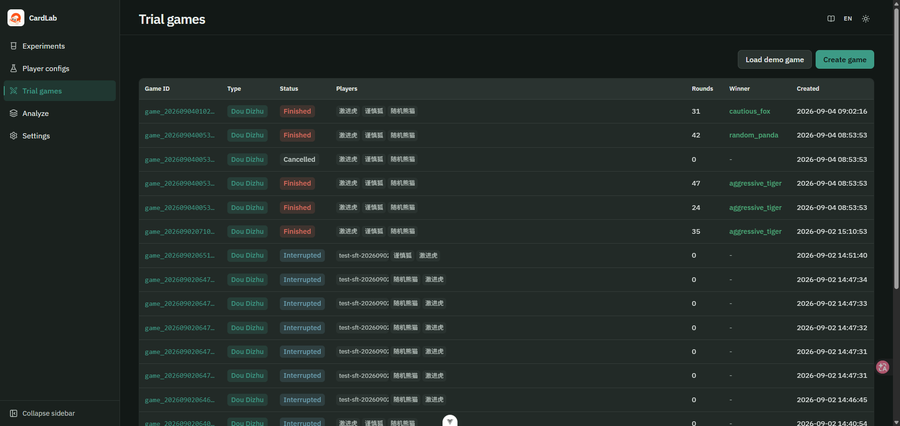
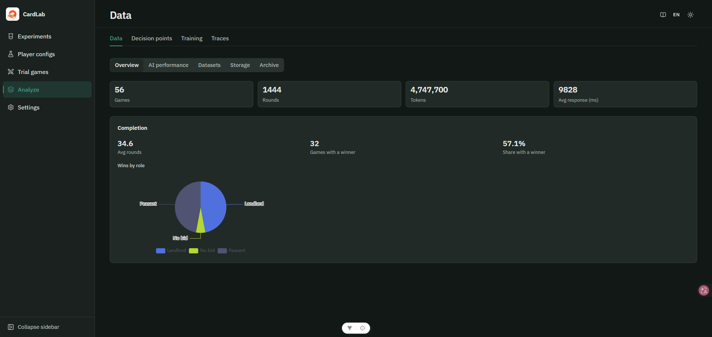
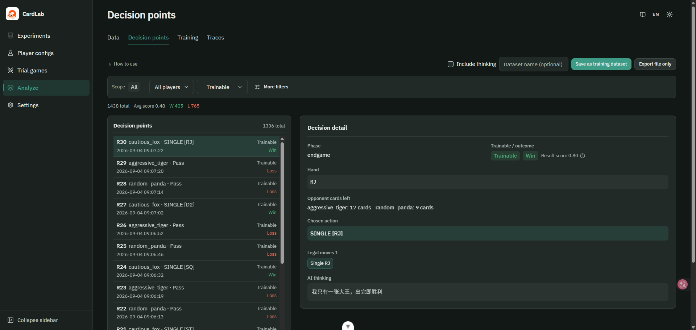
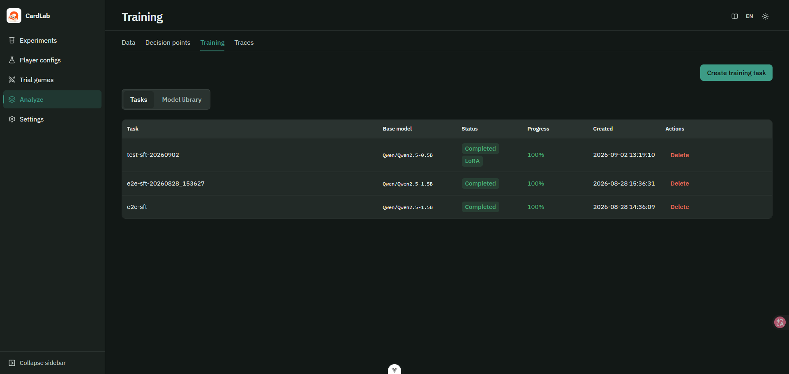
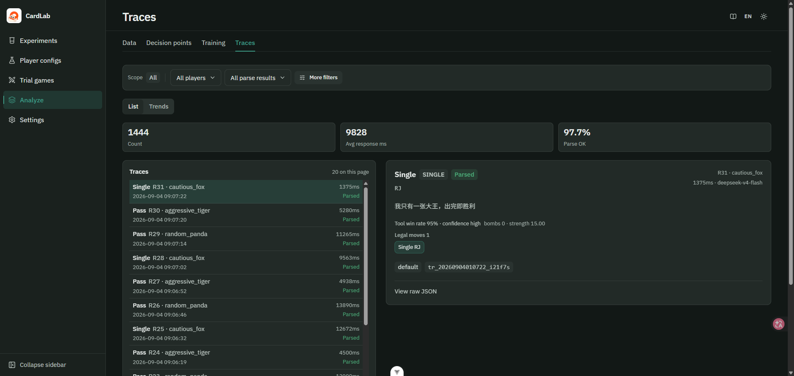

# CardLab

[中文](README.md) | English

Local AI card-game research tool: experiments as the unit—watch decisions, collect games, LoRA fine-tune, and validate with controls.

> **About models**: This project **calls** third-party LLM APIs (or local Ollama) for card-playing decisions—it does **not** distill or replicate any large model. LoRA fine-tuning uses game-play trajectory data (the user's own recorded games), not third-party API outputs for training competing models. All API calls comply with each provider's terms of service. The project itself **does not bundle any model weights**; users configure their own API keys or local models.

<p align="center">
  
</p>

<p align="center"><em>Experiment detail has five phases. Each phase states the current status and the next step. This is after collection — trainable decisions are ready, so the next step is Start training.</em></p>

## Stack

| Layer | Choice |
|-------|--------|
| Frontend | Vue 3 · TypeScript · Vite · Tailwind v4 · Reka UI |
| Backend | Python 3.11+ · FastAPI · WebSocket |
| LLM | OpenAI · Ollama · DashScope · DeepSeek · Kimi · Zhipu · Yi · Baichuan · MiniMax |
| Storage | SQLite index + JSONL archive |
| Training | PEFT LoRA (`poetry install --with training`; CPU smoke without GPU; optional 4-bit QLoRA needs bitsandbytes) |

## Quick start

**Requires**: Python 3.11+ · Node 20.19+ / 22.12+ · Poetry · (optional) Ollama

```bash
git clone https://github.com/blueWhalei/ai-card-game-lab.git
cd ai-card-game-lab
cp .env.example .env    # Windows: copy .env.example .env
```

Start in two terminals:

| Platform | Backend (:8000) | Frontend (:5173) |
|----------|-----------------|------------------|
| Windows | `scripts\start-backend.bat` | `scripts\start-frontend.bat` |
| macOS / Linux | `chmod +x scripts/*.sh` then `./scripts/start-backend.sh` | `./scripts/start-frontend.sh` |

Or manually: `cd server && poetry install && poetry run uvicorn ...` · `cd web && npm install && npm run dev`.

Open http://localhost:5173 . Home walks you through provider → players → experiment. Create **Player configs** first (Dou Dizhu needs 3). Set at least one API key or local Ollama in `.env`. No key? Use **Load demo game** on the home page.

## Main loop

1. **Player configs** — model and sampling  
2. **New experiment** — pick players and target games (does not auto-start)  
3. **Start experiment** — the detail page's current phase offers one button, Start experiment; watch and replay
4. **Start training** — export ChatML when trainable decisions are ready
5. **Model repo** — push to Ollama or register as player  
6. **Control / compare** — after training, the detail page asks you to start a control experiment (same deals); once it is ready the first screen is a one-sentence verdict plus Δ. When the evidence is thin the number reads lighter and the page tells you how many more games it needs. Per-scenario gaps sit below as a small chart; the compare page still has the full matrix  

Benchmark mode uses fixed deal seeds (up to 50 games). Trial games live at `/game` (not tied to experiments). Decisions, traces, data, and training are under **Analyze** (`/pipeline/…`, `?experiment_id=`). Export an experiment pack from detail (no API keys) and import it on the home page to reproduce on another machine. Usage guide: header book icon → `/guide`.

Script loop: `.\scripts\e2e_pipeline.ps1 all -Count 1` — see [E2E guide](docs/E2E_PIPELINE.md).

## Screenshots

<table>
  <tr>
    <td width="50%" valign="top">
      
      <p><strong>Player configs</strong> — model and sampling per seat; import / export packs. Packs do not include API keys.</p>
    </td>
    <td width="50%" valign="top">
      
      <p><strong>Trial games</strong> — one-off matches outside experiments; or load a demo and watch.</p>
    </td>
  </tr>
  <tr>
    <td width="50%" valign="top">
      
      <p><strong>Analyze · Data</strong> — corpus size, completion, landlord / peasant win split.</p>
    </td>
    <td width="50%" valign="top">
      
      <p><strong>Analyze · Decisions</strong> — state, legal moves, thinking, train-usable; export ChatML.</p>
    </td>
  </tr>
  <tr>
    <td width="50%" valign="top">
      
      <p><strong>Analyze · Training</strong> — PEFT LoRA tasks and the model repo; register a finished tag as a player.</p>
    </td>
    <td width="50%" valign="top">
      
      <p><strong>Analyze · Traces</strong> — latency, parse rate, tool calls, raw JSON.</p>
    </td>
  </tr>
</table>

## Config

`.env` at repo root:

```bash
DEEPSEEK_API_KEY=sk-...
DEEPSEEK_BASE_URL=https://api.deepseek.com/v1
# or OPENAI_API_KEY / OLLAMA_BASE_URL=http://localhost:11434
```

| provider | example model |
|----------|----------------|
| `openai` | `gpt-4o-mini` |
| `deepseek` | `deepseek-v4-flash` |
| `ollama` | `qwen2.5:7b` |
| `dashscope` | `qwen-plus` |

## Links

| URL | |
|-----|---|
| https://blueWhalei.github.io/ai-card-game-lab/en/ | Project page |
| http://localhost:5173 | UI |
| http://localhost:8000/docs | API docs |
| http://localhost:8000/api/v1/system/preflight | Preflight (run-ready) |

## Docs

| Doc | |
|-----|---|
| [E2E pipeline](docs/E2E_PIPELINE.md) | Collect → train → deploy |
| [Architecture](docs/ARCHITECTURE.md) | Layers and flows |
| [API design](docs/API_DESIGN.md) | REST + WebSocket |
| [Project structure](docs/PROJECT_STRUCTURE.md) | Directory map |
| [Coding standards](docs/CODING_STANDARDS.md) | Python / Vue / i18n |
| [Examples](docs/EXAMPLES.md) | New engine / provider |
| [CLAUDE.md](CLAUDE.md) | Agent entry |

## License

[MIT](LICENSE)