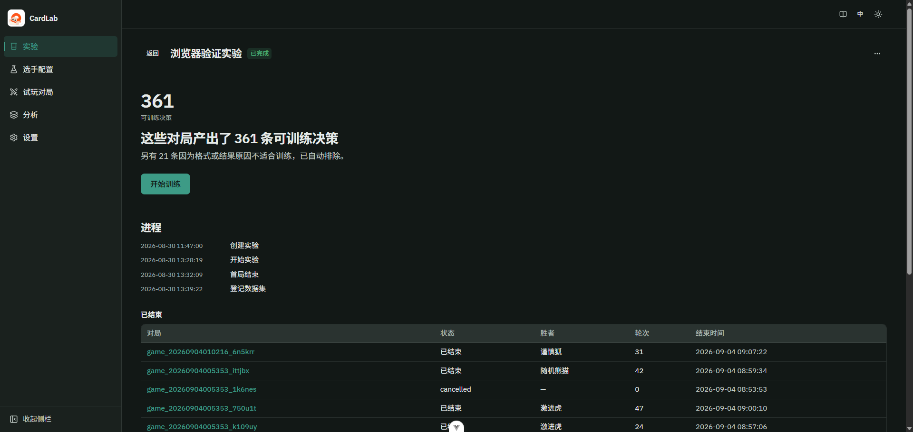
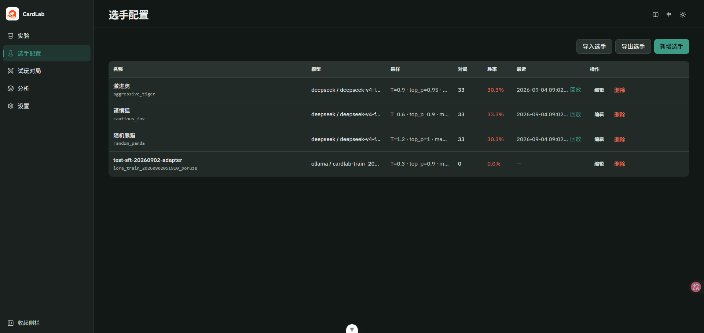
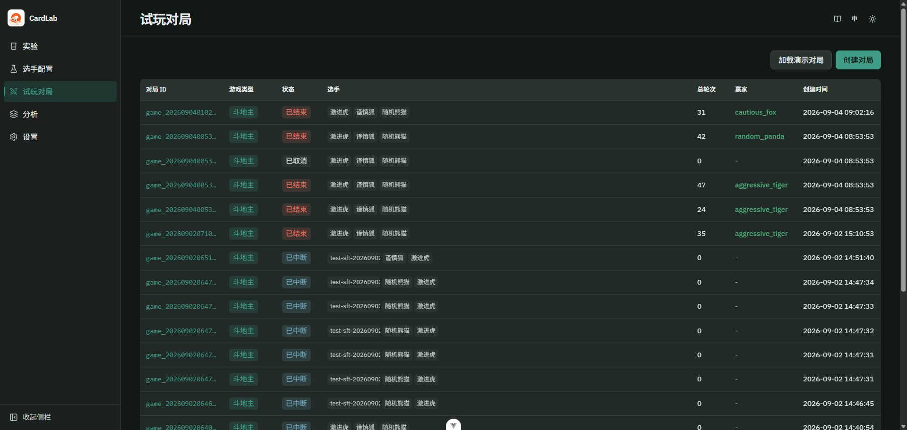
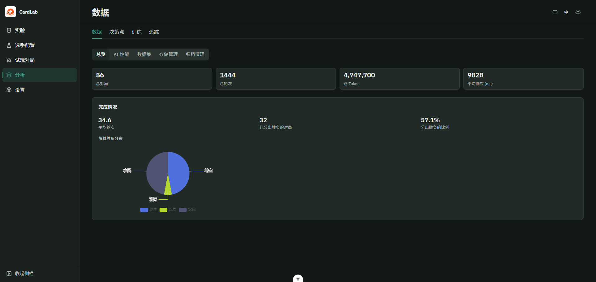
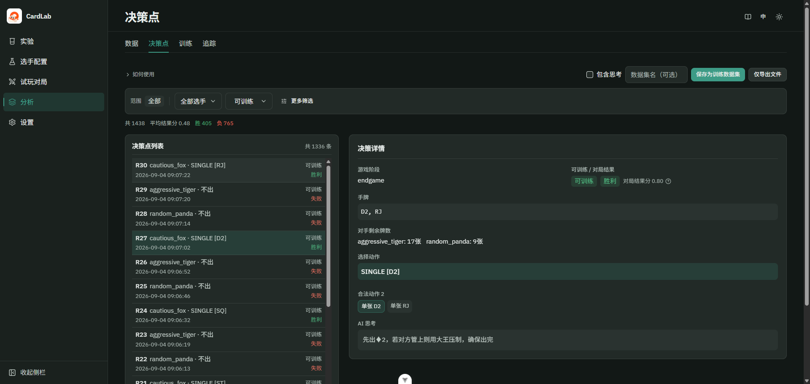
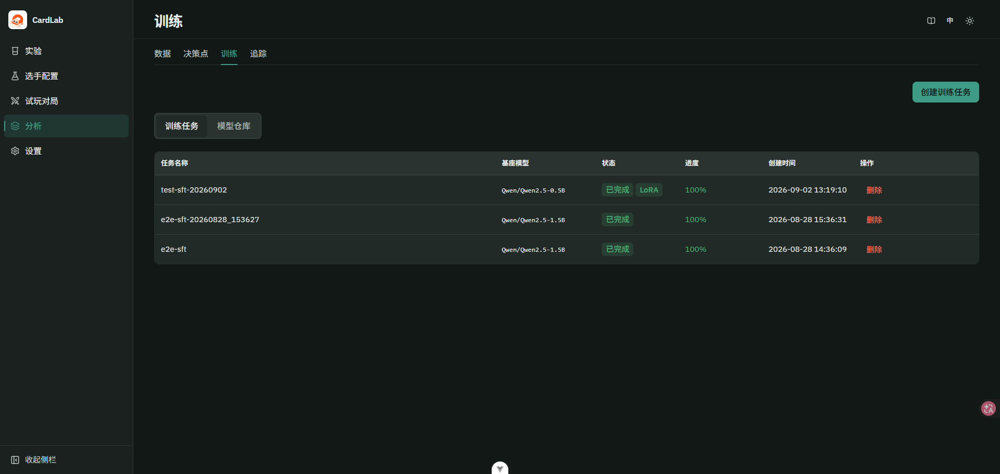
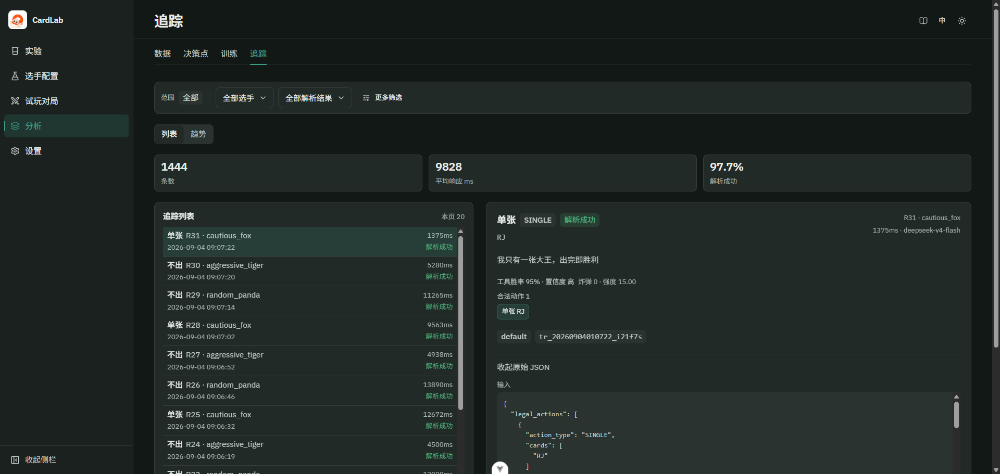

# CardLab

[English](README.en.md) | 中文

本地 AI 卡牌研究工具：以「实验」为主线，观战模型决策、采集对局数据、LoRA 微调与对照验证。

> **关于模型**：本项目是**调用**第三方 LLM API（或本地 Ollama）进行卡牌决策，而非对任何大模型进行蒸馏或复制。LoRA 微调使用的是对局行为轨迹数据（用户自己的对局记录），不涉及将第三方 API 输出用于训练竞品模型。所有 API 调用均按各供应商服务条款合规使用。项目本身**不内置任何模型权重**，用户自行配置 API Key 或本地模型。

<p align="center">
  
</p>

<p align="center"><em>实验详情按进度分五个阶段，每个阶段只说明当前状态，并给出下一步。上图是采集完成后——可训练决策就绪，下一步是开始训练。</em></p>

## 技术栈

| 层级 | 选型 |
|------|------|
| 前端 | Vue 3 · TypeScript · Vite · Tailwind v4 · Reka UI |
| 后端 | Python 3.11+ · FastAPI · WebSocket |
| LLM | OpenAI · Ollama · DashScope · DeepSeek · Kimi · Zhipu · Yi · Baichuan · MiniMax |
| 存储 | SQLite 索引 + JSONL 归档 |
| 训练 | PEFT LoRA（`poetry install --with training`；无 GPU 走 CPU 快速验证；可选 4-bit QLoRA 需自行安装 bitsandbytes） |

## 快速开始

**环境**：Python 3.11+ · Node 20.19+ / 22.12+ · Poetry ·（可选）Ollama

```bash
git clone https://github.com/blueWhalei/ai-card-game-lab.git
cd ai-card-game-lab
cp .env.example .env    # Windows: copy .env.example .env
```

两个终端分别启动：

| 平台 | 后端（:8000） | 前端（:5173） |
|------|---------------|---------------|
| Windows | `scripts\start-backend.bat` | `scripts\start-frontend.bat` |
| macOS / Linux | `chmod +x scripts/*.sh` 后 `./scripts/start-backend.sh` | `./scripts/start-frontend.sh` |

也可手动：`cd server && poetry install && poetry run uvicorn ...` · `cd web && npm install && npm run dev`。

打开 http://localhost:5173 。首页会按「密钥 → 选手 → 实验」引导到第一局。首次请在「选手配置」页创建选手（斗地主需 3 个），`.env` 至少配置一个 API 密钥或本机 Ollama。无密钥可首页「加载演示对局」体验观战。

## 主路径

1. **选手配置** → 设置模型与采样参数  
2. **新建实验** → 选选手与目标局数（不会自动开始对局）  
3. **开始实验** → 详情页当前阶段给出唯一按钮「开始实验」；可观战、回放  
4. **开始训练** → 可训练决策就绪后导出 ChatML 并创建任务  
5. **模型仓库** → 推送到 Ollama 或登记为选手  
6. **对照 / 对比** → 训练完成后详情页让你开始对照实验（相同发牌）；对照就绪后首屏直接是一句结论加 Δ，证据不足时数字会显得更轻，并给出还需多少局；分场景差异在下方小图里，完整矩阵仍在对比页

基准测验模式使用固定发牌种子（最多 50 局）。试玩对局在侧栏 `/game`，不计入实验。决策点、追踪、数据、训练在侧栏「分析」（`/pipeline/…`，支持 `?experiment_id=`）。实验详情可导出 JSON 实验包（包内不含 API 密钥），首页可导入以在另一台机器复现。使用说明：顶栏书本图标 `/guide`。

脚本闭环：`.\scripts\e2e_pipeline.ps1 all -Count 1` — 详见 [E2E 指南](docs/E2E_PIPELINE.md)。

## 界面

<table>
  <tr>
    <td width="50%" valign="top">
      
      <p><strong>选手配置</strong> — 为每个座位指定模型与采样；可导入 / 导出选手包，包内不含 API 密钥。</p>
    </td>
    <td width="50%" valign="top">
      
      <p><strong>试玩对局</strong> — 不计入实验的单局；也可加载演示对局先看观战。</p>
    </td>
  </tr>
  <tr>
    <td width="50%" valign="top">
      
      <p><strong>分析 · 数据</strong> — 语料规模、完成情况、地主 / 农民胜负分布。</p>
    </td>
    <td width="50%" valign="top">
      
      <p><strong>分析 · 决策点</strong> — 每步状态、合法行动、思考与是否可训练；可导出 ChatML。</p>
    </td>
  </tr>
  <tr>
    <td width="50%" valign="top">
      
      <p><strong>分析 · 训练</strong> — PEFT LoRA 任务与模型仓库；完成后可登记为选手。</p>
    </td>
    <td width="50%" valign="top">
      
      <p><strong>分析 · 追踪</strong> — 延迟、解析成功率、工具调用与原始 JSON。</p>
    </td>
  </tr>
</table>

## 配置

`.env` 示例（项目根目录）：

```bash
DEEPSEEK_API_KEY=sk-...
DEEPSEEK_BASE_URL=https://api.deepseek.com/v1
# 或 OPENAI_API_KEY / OLLAMA_BASE_URL=http://localhost:11434
```

| provider | model 示例 |
|----------|-------------|
| `openai` | `gpt-4o-mini` |
| `deepseek` | `deepseek-v4-flash` |
| `ollama` | `qwen2.5:7b` |
| `dashscope` | `qwen-plus` |

## 链接

| 地址 | 说明 |
|------|------|
| https://blueWhalei.github.io/ai-card-game-lab/ | 项目页 |
| http://localhost:5173 | 前端 |
| http://localhost:8000/docs | API 文档 |
| http://localhost:8000/api/v1/system/preflight | 开始前检查 |

## 文档

| 文档 | 说明 |
|------|------|
| [E2E 闭环](docs/E2E_PIPELINE.md) | 采集 → 训练 → 部署 |
| [架构](docs/ARCHITECTURE.md) | 分层与核心流程 |
| [API](docs/API_DESIGN.md) | REST + WebSocket |
| [目录结构](docs/PROJECT_STRUCTURE.md) | 模块地图 |
| [编码规范](docs/CODING_STANDARDS.md) | Python / Vue / i18n |
| [开发示例](docs/EXAMPLES.md) | 新引擎 / 供应商 |
| [CLAUDE.md](CLAUDE.md) | Agent 开发入口 |

## License

[MIT](LICENSE)